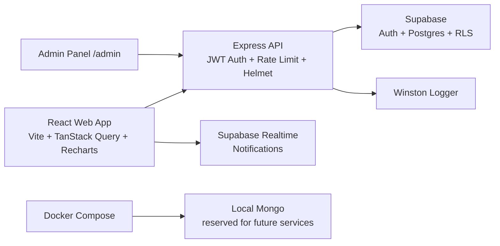

# TrueStake

TrueStake is a prediction-market monorepo with an Express API, React web app, Supabase persistence/auth, wallet flows, user dashboards, and an admin panel.


## Architecture



The web app talks to dedicated API routes. The API uses Supabase service credentials for server-side access, while Supabase Row Level Security protects direct wallet, transaction, and trade access for authenticated users.

## Setup

1. Install Node 20 and pnpm 9.
2. Install dependencies:

```bash
pnpm install
```

3. Create environment files:

```bash
cp apps/api/.env.example apps/api/.env
cp apps/web/.env.example apps/web/.env
```

4. Apply `supabase/schema.sql` in Supabase SQL editor.
5. Start development:

```bash
pnpm dev
```

Web: `http://localhost:5173`  
API: `http://localhost:3001`

## Environment Variables

| App | Variable                    | Required | Description                                       |
| --- | --------------------------- | -------- | ------------------------------------------------- |
| api | `PORT`                      | No       | API port, defaults to `3001`.                     |
| api | `SUPABASE_URL`              | Yes      | Supabase project URL.                             |
| api | `SUPABASE_SERVICE_ROLE_KEY` | Yes      | Server-side Supabase key for admin operations.    |
| api | `SUPABASE_ANON_KEY`         | No       | Fallback Supabase key.                            |
| api | `SUPABASE_JWT_SECRET`       | Yes      | JWT secret used to verify Supabase access tokens. |
| api | `FRONTEND_URL`              | Yes      | Allowed web origin for CORS.                      |
| api | `LOG_LEVEL`                 | No       | Winston log level.                                |
| web | `VITE_API_URL`              | Yes      | API base URL.                                     |
| web | `VITE_SUPABASE_URL`         | No       | Needed for realtime notifications.                |
| web | `VITE_SUPABASE_ANON_KEY`    | No       | Needed for realtime notifications.                |

## API Docs

Base URL: `http://localhost:3001`

| Method  | Path                             | Auth   | Description                     |
| ------- | -------------------------------- | ------ | ------------------------------- |
| `POST`  | `/auth/register`                 | Public | Register a user.                |
| `POST`  | `/auth/login`                    | Public | Login and receive tokens.       |
| `GET`   | `/markets`                       | Public | List markets.                   |
| `GET`   | `/markets/:id`                   | Public | Get market details.             |
| `POST`  | `/trades`                        | User   | Place a trade.                  |
| `GET`   | `/wallet/me`                     | User   | Wallet and transaction history. |
| `POST`  | `/wallet/deposit`                | User   | Mock payment deposit.           |
| `POST`  | `/wallet/withdraw`               | User   | Create pending withdrawal.      |
| `GET`   | `/dashboard/trending`            | User   | Trending markets.               |
| `GET`   | `/dashboard/portfolio`           | User   | Trades and P&L.                 |
| `GET`   | `/dashboard/leaderboard`         | User   | Top earners.                    |
| `GET`   | `/dashboard/profile`             | User   | User stats.                     |
| `POST`  | `/admin/markets`                 | Admin  | Create market.                  |
| `PATCH` | `/admin/markets/:id/resolve`     | Admin  | Resolve market and payouts.     |
| `GET`   | `/admin/users`                   | Admin  | User management data.           |
| `POST`  | `/admin/users/:id/ban`           | Admin  | Ban a user.                     |
| `POST`  | `/admin/users/:id/unban`         | Admin  | Unban a user.                   |
| `GET`   | `/admin/withdrawals`             | Admin  | Withdrawal queue.               |
| `POST`  | `/admin/withdrawals/:id/approve` | Admin  | Approve withdrawal.             |
| `POST`  | `/admin/withdrawals/:id/reject`  | Admin  | Reject and refund withdrawal.   |
| `GET`   | `/admin/analytics`               | Admin  | Platform analytics.             |

## Docker

```bash
docker compose up --build
```

Services:

| Service | Port    | Purpose                                              |
| ------- | ------- | ---------------------------------------------------- |
| `web`   | `5173`  | Vite React app                                       |
| `api`   | `3001`  | Express API                                          |
| `mongo` | `27017` | Local Mongo service reserved for future integrations |

## Quality

```bash
pnpm build
pnpm lint
```

CI runs lint and type-check/build on pull requests through `.github/workflows/ci.yml`.
